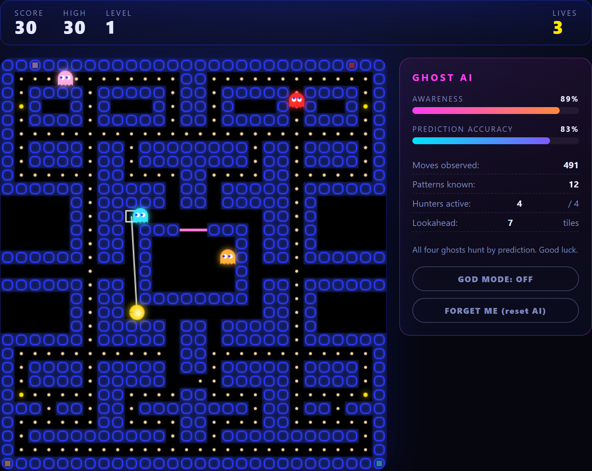
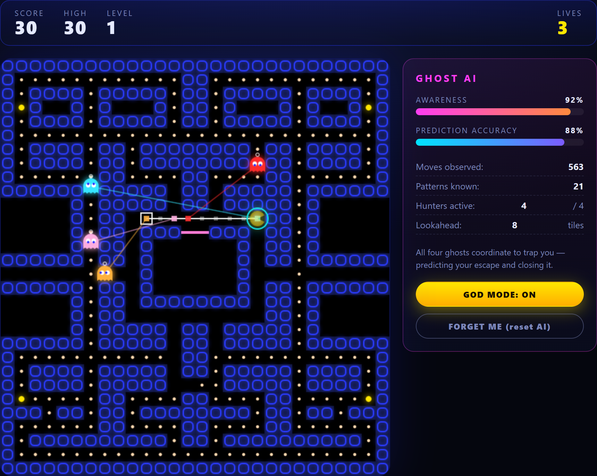
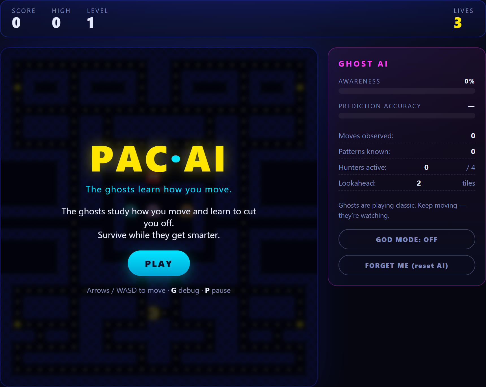
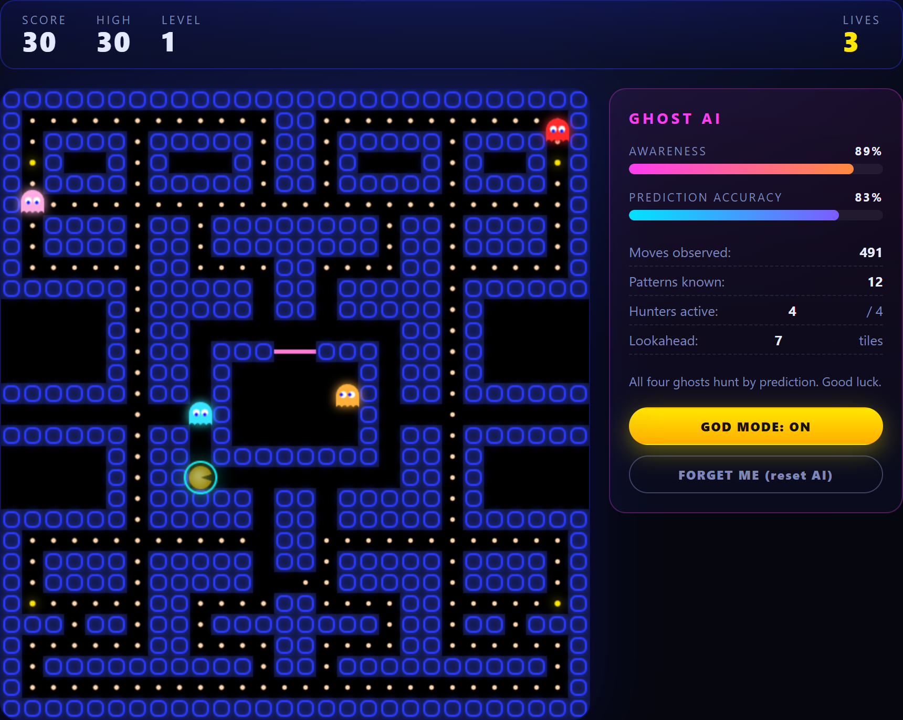

# PAC·AI — Pac-Man with a Learning Brain

A faithful, browser-based Pac-Man where the ghosts **learn how you move**.
The longer you play, the better they predict where you're going — and the more
of them switch from classic chasing to actively cutting you off.

No build step, no dependencies. Just open `index.html`.



> The **GHOST AI** panel shows the model in action: 89% aware, predicting your
> path 7 tiles ahead, all four ghosts hunting. The white box (debug overlay) is
> where the AI thinks you're about to be.

## The idea

Classic Pac-Man ghosts work by aiming at a *target tile* each frame and taking
the non-reversing move that gets them closest to it. PAC·AI keeps that authentic
movement rule and lets a learning model **rewrite the target tile** — pointing
the smartest ghosts at where you're *about to be* instead of where you are.

### How the AI works

- **Situational pattern model** — your choices at intersections feed a
  variable-order Markov model whose context includes not just your last 1–2
  moves but the *direction of the nearest threat*, so it learns reactions like
  "when chased from the left, this player bolts right."
- **Prediction** — the model is rolled forward several tiles to estimate your
  future *path*, not just where you are now.
- **Coordinated trapping** — instead of every ghost chasing the same tile, the
  hunters split across four intercept points (deep cut-off, near cut-off, a
  heatmap ambush of your favourite spot, and a rear pincer). Each ghost is
  assigned the point it can reach fastest via a tunnel-aware breadth-first
  search — a real trap, not a clump.
- **Accuracy tracking** — every intersection, the prediction is compared to your
  actual move to measure how well it knows you.
- **Awareness (0 → 100%)** — grows with experience × accuracy. It drives:
  - how many ghosts hunt/coordinate (`0 → 4`),
  - how far ahead the model looks (`2 → 8` tiles),
  - ghost speed and how short their scatter breaks get.
- **Memory** — the model is saved to `localStorage`, so the ghosts remember your
  habits across sessions. Use **FORGET ME** to wipe it.

Toggle the debug overlay (**G**) to *see* it: a white box and dotted trail mark
your predicted path, and a coloured line links each hunter to its intercept tile.



> The debug overlay at 92% awareness: all four ghosts coordinate, each line
> running to a *different* intercept tile around the AI's predicted path
> (white dotted trail). God Mode is on, so you can watch the trap form.

## Screenshots

| Title | God mode |
| --- | --- |
|  |  |

## Play

| Action | Keys |
| --- | --- |
| Move | Arrow keys or `W A S D` |
| Pause | `P` |
| Debug overlay | `G` (or `` ` ``) |
| God mode (untouchable) | `V`, or the on-screen button |
| Start / restart | `Enter`, `Space`, or the on-screen button |

**God mode** makes Pac-Man untouchable (he turns translucent with a glowing
aura) so you can roam indefinitely and watch how far the ghosts' awareness
climbs as they learn your habits — without dying and resetting the round.

Eat all the pellets to clear the level. Power pellets turn the ghosts blue —
eat them for escalating points (200 → 1600). Watch the **GHOST AI** panel:
when *Hunters active* climbs toward 4, the ghosts start intercepting your
favourite routes.

## Run it

Open `index.html` directly in any modern browser, or serve the folder:

```bash
# Python
python -m http.server 8000
# then visit http://localhost:8000

# or Node
npx serve .
```

## Project layout

```
index.html      Page shell, HUD, AI panel, overlays
style.css       Neon arcade styling
js/
  maze.js       Board layout, tile helpers, pellet state, rendering
  input.js      Keyboard handling
  pacman.js     Player + shared grid-movement helper
  ghost.js      Four ghosts, scatter/chase/frightened/eaten state machine
  ai.js         The learning brain (Markov model, prediction, persistence)
  game.js       Main loop, rules, scoring, and AI ⇄ ghost wiring
```

## Notes

- The maze is a hand-built 28×30 grid, validated so every pellet is reachable
  and the tunnel and ghost house behave correctly.
- Ghosts begin playing pure classic Pac-Man. The "smart" behaviour ramps up with
  the awareness meter, so give it a few rounds (or hit **G**) to see it adapt.

## License

MIT
